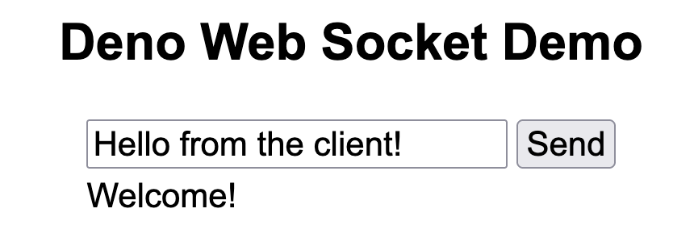

# Deno Web Socket Demo

Deno is a Javascript runtime, which is meant to be an improvement on NodeJS. This minimal application demonstrates how to set up bidirectional client-server communication using the Web Socket protocol. It uses the Oak framework for routing.

## Set-up

To install Deno on Mac or Linux, open a terminal window and run:

<pre>
curl -fsSL https://deno.land/install.sh | sh</pre>

To clone the repository, run the following command:

<pre>
git clone git@github.com:Indrikoterio/deno-ws-demo.git</pre>

Next install Oak.

<pre>
cd deno-ws-demo
deno add jsr:@oak/oak</pre>

You can start the server with the command:

<pre>
deno run --allow-net --allow-read main.ts
</pre>

Open your browser to localhost:4000 .

You will see.

Click on Send. You should get a message back: "You said: Hello from the client!"

## Developer

deno-ws-demo was developed by Cleve (Klivo) Lendon.

## Contact

To contact the developer, send email to indriko@yahoo.com . 
Comments, suggestions and criticism are welcomed.

## History

First release, October 2024.

## License

Use this source code as you wish and at your own risk.

